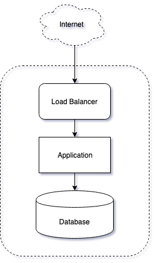

# DevOps Test Task

### Use-case:

Customer has a Web application written in python with Flask which uses a Postgres relational database management system. 
Application exposes the REST API that allows querying the database and retrieve the dataset. 
Currently the app is hosted in a co-location on physical servers and customer wants to migrate it to the cloud. 
Your task is to advise the deployment scenario, propose tools, create all necessary configurations 
and execute the application migration (assuming there should be no downtime).

### Coding
Add application functionality from list below:
- new endpoint 
  - accepting POST type requests
  - accepting JSON payload
  - able to add new rows into the database with fields from the payload

### Infrastructure specific requirements:
- Deployment of the Infrastructure and application should be automated and described as a code. Use Azure DevOps service. 
- Application should be run in Azure App Services;
- Application should be presented as a docker image;
- There should be no self-managed servers used in the solution;
- Access to the application should be restricted: only whitelisted IP addresses/networks 
should be allowed to access the API;
- SSL should be used to secure the http traffic (self-signed certificate may be used);
- Project should be published on GitHub;

### KPI:
- Application could be deployed and launched in the cloud;
- API endpoints returns data;
- Communications are secured;
- Infrastructure as code, automation scripts and configurations are available on GitHub;

### How-to start the app:
- Set environmental variables;
- Setup database using provided sql script;
- Use Python 3;
- Install requirements;
- run app.py;

### Sample Target Architecture:  

